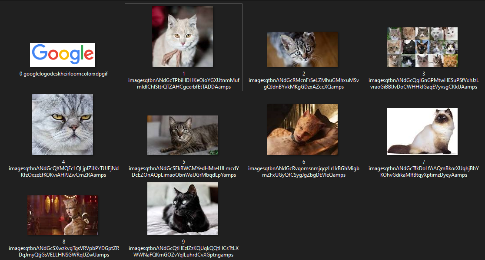

# Image Downloader WebService
## ImageDownloaderWebService is a small web service for downloading the required number of images from any website.
Example of downloading 10 cats images from google images

Service inputs 3 parameters: url, images count and max count of threads that will be used. Service downloads images to the "images" folder that is located with the solution.
## Installation
1. Clone respository
2. Open "PhotoWebService.sln" with your Visual Studio
3. Build it!
If you want to request service open ConsoleLauncher/ConsoleApp.sln with Visual Studio and build it. This is a small console app that is accesses the service.
